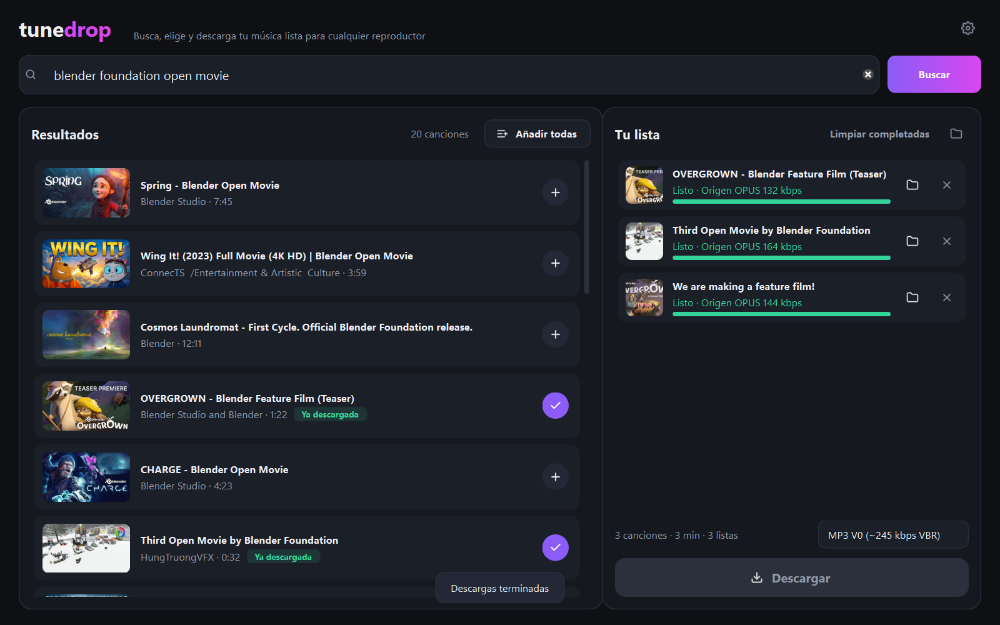

<p align="center">
  
</p>

<h1 align="center">tunedrop</h1>

<p align="center">
  <b>Busca tus canciones, márcalas y descárgalas de una vez en MP3,<br>
  con título, artista y carátula, listas para tu reproductor MP3 o iPod.</b>
</p>

<p align="center">
  <a href="../../releases/latest"><b>⬇ Descargar para Windows y Linux</b></a> ·
  <a href="docs/1-como-esta-organizado.md">Cómo funciona</a> ·
  <a href="docs/2-ejecutar-desde-el-codigo.md">Ejecutar desde el código</a>
</p>



> Proyecto de estudiante de **ASIR**, de código abierto. Todo el código está en este repositorio, y el programa descargable se compila de forma pública y automática a partir de él (ver [¿Es fiable?](#es-fiable)).

---

## Qué hace

- 🔎 **Busca** canciones escribiendo su nombre, o pega un enlace de YouTube, una playlist, SoundCloud, Bandcamp…
- ➕ **Elige** las que quieras con un clic, o **Añadir todas** para una playlist entera.
- ⬇ **Descarga** todas de una vez, con varias en paralelo y el progreso de cada una.
- 🎵 **Archivos listos para reproductores e iPods**:
  - Etiquetas de título, artista, álbum y año.
  - Carátula incrustada.
  - Todas las canciones juntas en una carpeta, con nombres ordenados: `Artista - Título.mp3`.
  - Títulos limpios, sin «(Official Video)».
- 🎚 **Calidad a elegir**: MP3 V0 (recomendado), MP3 320 kbps o M4A original sin pérdidas extra.

## Instalar con un solo comando

No necesitas Python ni nada más: el comando descarga la última versión desde [Releases](../../releases/latest) y la instala como cualquier app, solo para tu usuario y sin permisos de administrador. Para actualizar, vuelve a ejecutarlo.

**Windows**: abre **PowerShell** (menú Inicio → escribe «PowerShell») y pega:

```powershell
irm https://raw.githubusercontent.com/xcvlad/tunedrop/main/instalar/windows.ps1 | iex
```

tunedrop aparece en el menú Inicio y en el escritorio. Se desinstala desde *Configuración → Aplicaciones*.

**Linux**: abre una terminal y pega:

```bash
curl -fsSL https://raw.githubusercontent.com/xcvlad/tunedrop/main/instalar/linux.sh | bash
```

tunedrop aparece en el menú de aplicaciones, y también se abre escribiendo `tunedrop`. Para desinstalarlo, añade `-s -- --desinstalar` al final: `... | bash -s -- --desinstalar`.

> Pegar en la terminal un comando de internet es cómodo, pero solo debes hacerlo si confías en quien lo publica. Puedes leer antes lo que hace cada script: [`instalar/windows.ps1`](instalar/windows.ps1) y [`instalar/linux.sh`](instalar/linux.sh).

## Instalar a mano (descargando el archivo)

### Windows

1. Ve a **[Releases](../../releases/latest)** y descarga uno de los dos:
   - `tunedrop-X.Y.Z-setup.exe`: **instalador**. Lo instala como cualquier programa, sin pedir permisos de administrador.
   - `tunedrop-X.Y.Z-portable.zip`: **portable**. Se descomprime y se abre `tunedrop.exe`; no instala nada.
2. Ábrelo, busca una canción y pulsa **+**.
3. Pulsa **Descargar**. La música aparece en tu carpeta `Música\tunedrop`.

> ⚠ **Windows puede mostrar «Windows protegió su PC»** la primera vez. Pasa con cualquier programa nuevo que no ha pagado un certificado de firma, no porque tenga nada raro. Pulsa **Más información → Ejecutar de todas formas**. Si prefieres no fiarte, puedes [comprobar el archivo](docs/3-crear-el-exe.md#comprobar-una-descarga) o [ejecutarlo desde el código](docs/2-ejecutar-desde-el-codigo.md).

### Linux

1. Ve a **[Releases](../../releases/latest)** y descarga `tunedrop-X.Y.Z-linux-x86_64.tar.gz`.
2. Descomprímelo y abre la app desde una terminal:
   ```bash
   tar -xzf tunedrop-*-linux-x86_64.tar.gz
   ./tunedrop/tunedrop
   ```
3. La música aparece en tu carpeta de música (`~/Música/tunedrop` o `~/Music/tunedrop`).

> Si la ventana no se abre y ves un error sobre `xcb`, instala la librería que Qt necesita: `sudo apt install libxcb-cursor0` (Ubuntu/Debian), `sudo dnf install xcb-util-cursor` (Fedora) o `sudo pacman -S xcb-util-cursor` (Arch).

## Ejecutar desde el código (tres pasos)

Si tienes [Python](https://www.python.org/downloads/) 3.10 o superior instalado, usa los scripts de la carpeta **`desde-el-codigo/`**:

| Windows (doble clic) | Linux (`bash <archivo>` en la terminal) | Qué hace |
|---|---|---|
| `1_instalar.bat` | `1_instalar.sh` | Prepara todo, **solo la primera vez**. En Linux también añade tunedrop al menú de aplicaciones. |
| `2_abrir_tunedrop.bat` | `2_abrir_tunedrop.sh` | Abre la app. |
| `3_crear_exe.bat` | `3_crear_app.sh` | *(Opcional)* Crea tu propio programa para distribuir en `dist/`. |

La explicación paso a paso está en **[Ejecutar desde el código](docs/2-ejecutar-desde-el-codigo.md)**.

## Documentación

| Guía | Para qué |
|---|---|
| [1 · Cómo está organizado](docs/1-como-esta-organizado.md) | Qué es cada archivo y cómo funciona la app por dentro. |
| [2 · Ejecutar desde el código](docs/2-ejecutar-desde-el-codigo.md) | Instalar Python, abrir la app y ejecutar los tests. |
| [3 · Crear el programa (Windows y Linux)](docs/3-crear-el-exe.md) | Cómo se empaqueta y cómo verificar una descarga. |
| [4 · Subir el proyecto a GitHub](docs/4-subir-a-github.md) | Guía paso a paso con git, desde cero. |

## ¿Es fiable?

- **Todo el código es abierto**: está en este repositorio y cualquiera puede leerlo.
- **El programa no se compila en el ordenador de nadie**: lo compila GitHub Actions a partir de este código, con el script [`packaging/build.py`](packaging/build.py). El registro completo de cada compilación es público en la pestaña **Actions**.
- **Cada descarga se puede verificar**: las Releases incluyen `SHA256SUMS.txt` y un certificado de procedencia (*attestation*) que demuestra que el archivo salió de este repositorio. Cómo se comprueba: [ver guía](docs/3-crear-el-exe.md#comprobar-una-descarga).
- **Sin servidores intermedios, anuncios ni telemetría**: la app se conecta directamente desde tu ordenador a YouTube o a la web que elijas. No envía datos a ningún otro sitio.

## Sobre la calidad del audio

YouTube guarda el audio a unos **128-160 kbps** (formatos Opus o AAC). Convertirlo a «MP3 320» no mejora el sonido; solo ocupa más espacio. Por eso:

- **MP3 V0** (por defecto) conserva todo lo que trae el original, con un buen tamaño y compatible con cualquier reproductor.
- **M4A** copia el audio original **tal cual**, sin volver a comprimirlo. El iPod lo lee de forma nativa.
- La app te muestra la **calidad real de origen** de cada canción.

## Hecho con

| Pieza | Qué hace | Licencia |
|---|---|---|
| [Python](https://www.python.org/) | Lenguaje de programación | PSF |
| [PySide6 (Qt)](https://doc.qt.io/qtforpython-6/) | Interfaz gráfica | LGPL-3.0 |
| [yt-dlp](https://github.com/yt-dlp/yt-dlp) | Conexión con YouTube y otras webs | Unlicense |
| [Deno](https://deno.com/) | Ejecuta el JavaScript que YouTube exige | MIT |
| [ffmpeg](https://ffmpeg.org/) ([compilación LGPL](https://github.com/BtbN/FFmpeg-Builds)) | Conversión a MP3 | LGPL-2.1+ |
| [mutagen](https://github.com/quodlibet/mutagen) | Etiquetas y carátula | GPL-2.0+ |
| [Pillow](https://python-pillow.org/) | Preparar la carátula | MIT-CMU |
| [PyInstaller](https://pyinstaller.org/) · [Inno Setup](https://jrsoftware.org/isinfo.php) | Crear el programa y el instalador de Windows | GPL con excepción · propia |

## Aviso legal

tunedrop es una herramienta para descargar contenido **del que tengas derechos**, con licencia libre (Creative Commons, dominio público) o para uso personal donde la ley de tu país lo permita. Las condiciones de uso de YouTube restringen la descarga de contenido, así que el uso que hagas es responsabilidad tuya. tunedrop no elude ningún sistema anticopia (DRM).

## Licencia

El código de tunedrop tiene licencia [MIT](LICENSE): puedes usarlo, copiarlo y modificarlo libremente, siempre que mantengas el aviso de copyright.

El programa descargable (Windows y Linux) incluye librerías con otras licencias (tabla de arriba). Como mutagen es GPL, el programa compilado en su conjunto se distribuye bajo las condiciones de la GPL. Esto se cumple porque todo su código fuente es público. Las licencias van incluidas en la carpeta `_internal/licencias` del programa.
